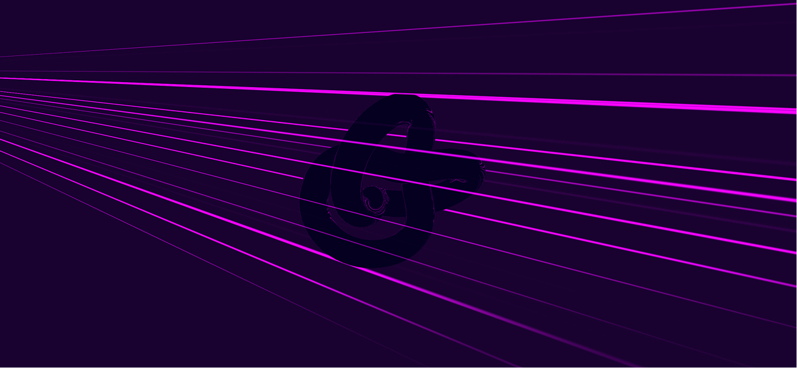
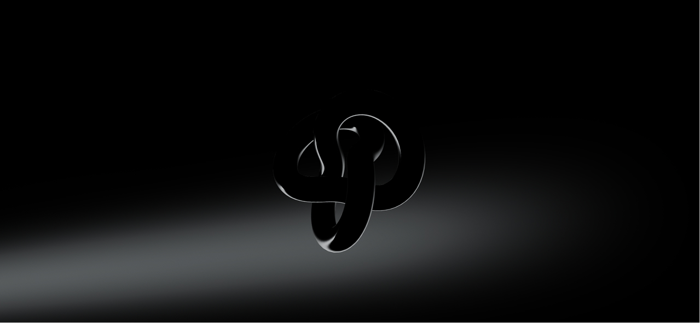
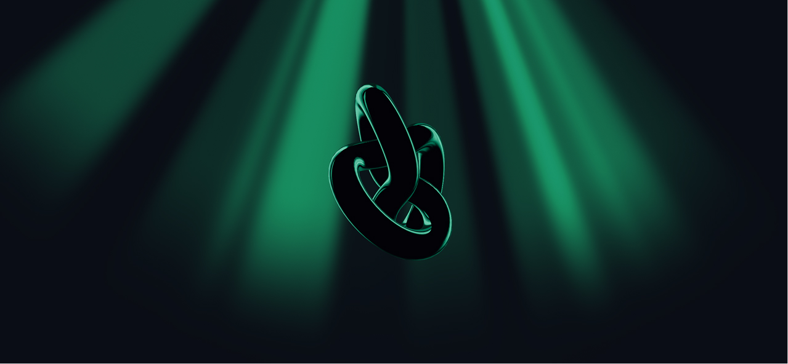

# Three.js Cinematic Rays

Stylized god rays for Three.js — pure `three`, no React Three Fiber.

```bash
pnpm install
pnpm dev
```

## Live demo

**Demo:** [http://localhost:3000](http://localhost:3000) _(replace with your deployed URL)_

## Screenshots







## Use in your project

Copy [`lib/godrays/`](./lib/godrays/) into your repo. See [`lib/godrays/README.md`](./lib/godrays/README.md).

You need two files minimum: `SpatialGodRays.ts` + `types.ts` (or import via `index.ts`).

The live demo uses `lib/demo/` — that folder is **not** part of the copy-paste package.

## Parameters

| Option | Type | Default | Description |
| --- | --- | ---: | --- |
| `visible` | `boolean` | `true` | Shows or hides the ray meshes. |
| `color` | `Vector3` | `(0.612, 0.639, 0.651)` | Ray color. |
| `opacity` | `number` | `0.58` | Layer alpha. |
| `intensity` | `number` | `0.75` | Overall light contribution. |
| `angle` | `number` | `-2.3` | Main ray direction in radians (`-π..π`, full 360°). |
| `origin` | `Vector2` | `(1.48, 1.86)` | Ray source in normalized screen coords (can be off-screen). |
| `z` | `number` | `-1.8` | Back ray sheet depth. |
| `frontZ` | `number` | `0.45` | Front ray sheet depth. |
| `raySpeed` | `number` | `0.62` | Motion animation speed. Set to `0` to freeze lane drift and orbit. Pulse uses `rayPulseSpeed` separately. |
| `rayMotion` | `0 \| 1 \| 2 \| 3` | `0` | `0` top→bottom, `1` bottom→top, `2` orbit CW, `3` orbit CCW. |
| `rayDepthMode` | `0 \| 1 \| 2` | `2` | `0` behind model, `1` in front, `2` both. |
| `raySpread` | `number` | `0.82` | Distance between ray lanes. |
| `rayLength` | `number` | `1.4` | Shaft length / fade distance. Range `0.05..4`. |
| `rayBrightness` | `number` | `1.0` | Extra shaft brightness multiplier. |
| `rayThickness` | `number` | `0.42` | Beam width. |
| `raySoftness` | `number` | `1.0` | Edge softness. |
| `rayCount` | `number` | `8` | Number of rays (`1..32`). |
| `raySeed` | `number` | random | Per-layer randomization seed. |
| `rayPulse` | `boolean` | `false` | Cyclic appear / disappear effect. |
| `rayPulseSpeed` | `number` | `0.35` | Pulse cycle speed. |
| `rayPulseAmount` | `number` | `1.0` | How much rays fade out (`0..1`). |
| `rayPulseStagger` | `number` | `0.45` | Phase offset between rays. |
| `background.transparent` | `boolean` | `false` | Transparent canvas background. |
| `background.color` | `string` | `"#0a0d15"` | Background color. |
| `#debug` | URL hash | — | Enables `lil-gui` controls and `stats.js` panel. |

Each frame: `rays.update(delta)`. On resize: `rays.resize(camera, width, height)`.

## Feedback & contributions

If this project helps you, consider:

- **Star the repo** on [GitHub](https://github.com/raganowicz/threejs-cinematic-rays) — it helps others find it and means a lot.
- **Report issues** via [GitHub Issues](https://github.com/raganowicz/threejs-cinematic-rays/issues) — bugs, ideas, and preset requests are welcome.
- **Contribute** — fork the repo, open a pull request, or share a preset or screenshot you are proud of.

## License

MIT — Copyright (c) 2026 Piotr Raganowicz-Macina. Please credit the author when using in a project.
